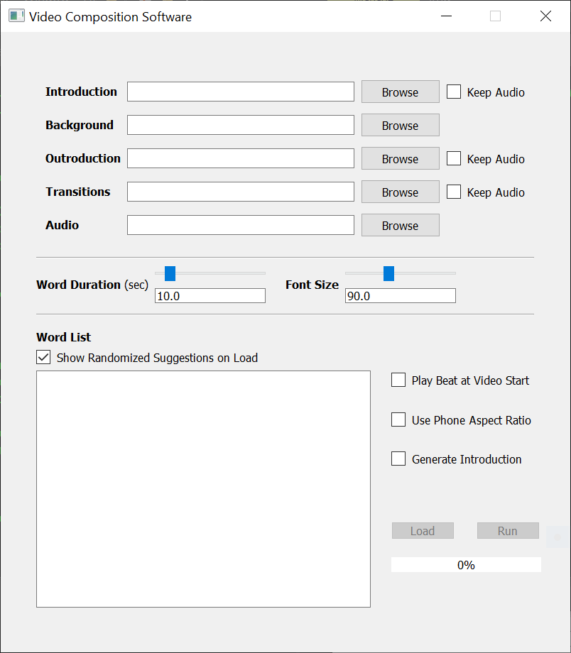
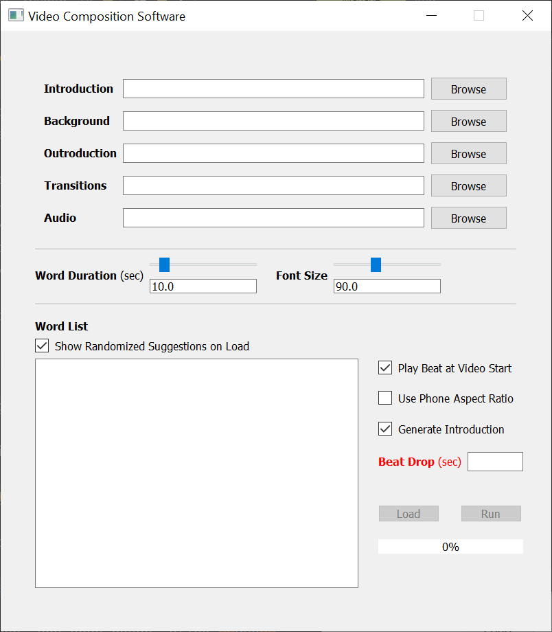
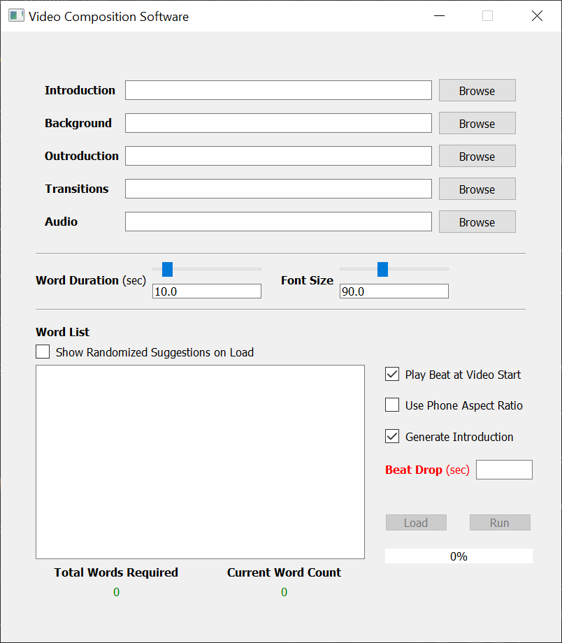
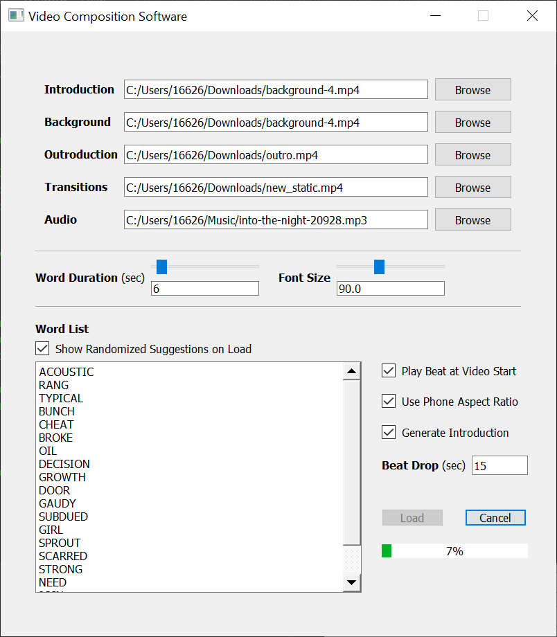

# Video-Composition-Software

A cross-platform video processing application developed in **python** using **moviepy** and **pyqt5**. It enables users to easily 
automate the production of videos that largely follow a particular, predefined format.

## Installation Guide
This installation guide has been written for with people new to python, git and other technologies and running Windows OS. Although this application will also run on Linux distributions, and was in-fact 
developed and thoroughly tested on Ubuntu.
### Python3
Please install the latest version of **Python3** found [here](https://www.python.org/downloads/). For Windows, install using the Python installer executable found [here](https://www.python.org/downloads/windows/).

### Pip
Make sure Python's pip module is installed. On Windows, if the executable file recommended above is used to install python, pip should be automatically installed. If pip hasn't been installed, please follow the instructions found [here](https://www.geeksforgeeks.org/how-to-install-pip-on-windows/#:~:text=Download%20and%20Install%20pip%3A&text=Download%20the%20get%2Dpip.py,where%20the%20above%20file%20exists.&text=and%20wait%20through%20the%20installation,now%20installed%20on%20your%20system.).

### PyQt5 
Install pyqt5 using pip by running the following command.

`pip install PyQt5`

### Moviepy
Install moviepy using pip by running the following command. On Windows, run this command using the Command Prompt (cmd).

`pip install moviepy`

### ImageMagick
Please install an ImageMagick distribution found [here](https://imagemagick.org/script/download.php). For Windows, download and install the Windows Binary Release.

## Clone this repository
Clone this repository on your computer using git. On Windows, use the Command Prompt (cmd).

Make a new directory on your computer by typing the following command:

`mkdir Code`

Navigate to the directory by typing:

`cd Code`
 
On this page, click on the green **Code** button, and copy the link under the *HTTPS* option. Then clone the repository using the following command in Command Prompt.

`git clone paste-the-link-you-copied-here`

Close the Command Prompt window.

## Execution

Open Command Prompt (cmd) in a new Window, and navigate to the *Code/Video-Composition-Software/src* directory using:

`cd Code/Video-Composition-Software/src`

Start the application using:

`python VideoCompositionSoftware.py`

The following window should open:

The following few bullet points provide further context about the various fields and options available to the user:

- **Browse** Buttons: Users can click on the browse buttons to specify the files which will be used in the corresponding part of the video (ie. introduction, background, etc). Only the background and audio files need to be specified, others files are optional.
- **Keep Audio** Checkboxes: User need to check the keep audio checkboxes if they want to retain the original audio stream from a video they have specified.
- **Word Duration** Slider and Text Edit: The word duration slider and text edit can be used to specify how long each word from the word list should remain on the screen in the final video. 
- **Font Size** Slider and Text Edit: The font size slider and text edit can be used to specify the font size of the text that will appear in the video.
- **Show Randomized Suggestions on Load** Checkbox: When this checkbox is checked, everytime that the user clicks **Load** the Word List will update with a new set of word recommendations.
- **Play Beat at Video Start** Checkbox: When checked, the beat will start playing at the start of the final video.
- **Use Phone Aspect Ratio** Checkbox: When checked, the video will be cropped to fit a typical vertical phone aspect ratio.
- **Generate Introduction** Checkbox: When checked, a new introduction will be generated from the specified background video. The length of this introduction will be until the **Beat Drop** time.

When the **Generate Introduction** checkbox is clicked, the **Beat Drop** text edit will become visible, and a value must be entered inorder to load media.

Finally, when the **Show Randomized Suggestions on Load** checkbox is unchecked, the total number of words required (based on the word duration) and the current word count specified will become visible. The media can only be loaded after the required
number of words have been specified.

To generate a new video:
- First, select the video and audio files using the browse buttons. 
- Then, set the word duration, font, play beat at video start, phone aspect ratio, or generate introduction options/fields.
- Press **Load** to get randomized suggestions (if **Show Randomized Suggestions on Load** is checked, otherwise enter your own words to match the total words required count).
- Change any words you don't like in the Word List.
- Press **Run** and you'll be prompted to specify a location where you want the output to be saved.
- Press **Save** to start generating the video.

## Output

### Coming Soon
