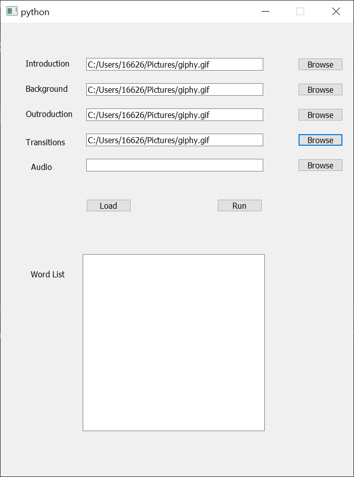
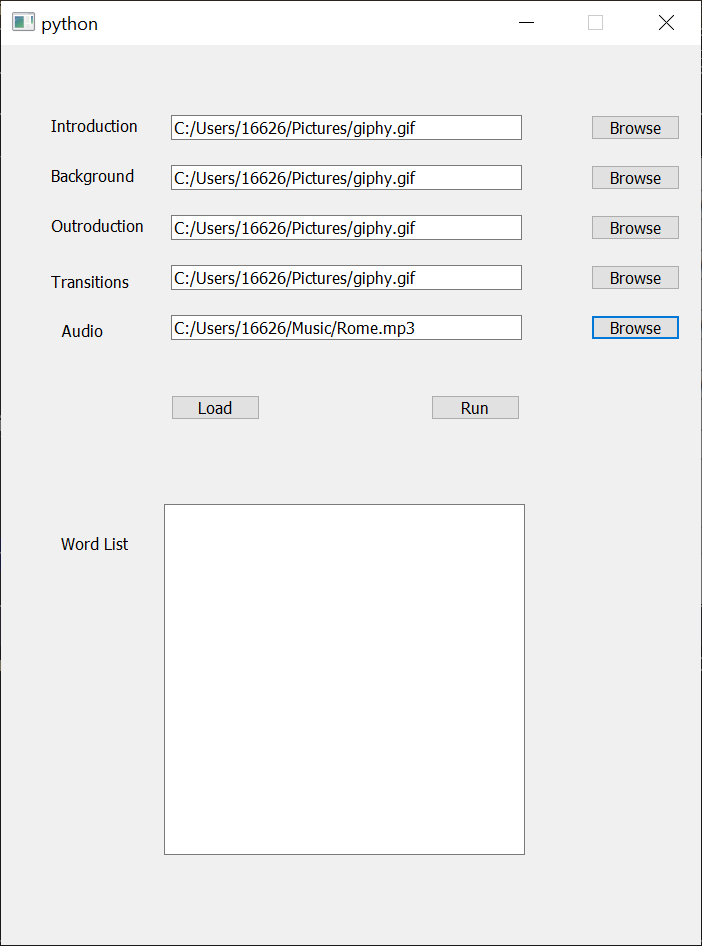
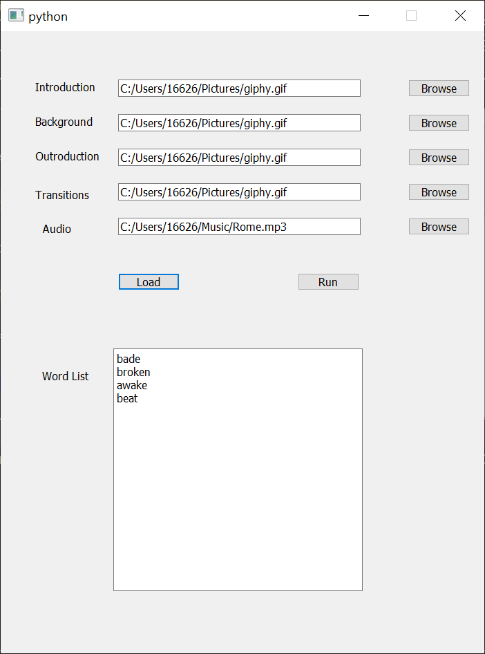

# Video-Composition-Software

A cross-platform video processing application developed in python using moviepy and pyqt. It enables users to easily 
automate the production of videos that follow a particular format.

## Installation Guide
This installation guide has been written for those using Windows and lacking familiarity with python, git and other technologies.    
### Python3
Please install the latest version of Python3 found [here](https://www.python.org/downloads/). For Windows, install using the Python installer executable found [here](https://www.python.org/downloads/windows/).

### Pip
Make sure Python's pip module is installed. On Windows, if the executable file recommended above is used to install python, pip should be automatically installed. If pip hasn't been installed, please follow the instructions found [here](https://www.geeksforgeeks.org/how-to-install-pip-on-windows/#:~:text=Download%20and%20Install%20pip%3A&text=Download%20the%20get%2Dpip.py,where%20the%20above%20file%20exists.&text=and%20wait%20through%20the%20installation,now%20installed%20on%20your%20system.).

### Moviepy
Install moviepy using pip by running the following command. On Windows, run this command using the Command Prompt (cmd).

`pip install moviepy`

### ImageMagick
Please install an ImageMagick distribution found [here](https://imagemagick.org/script/download.php). For Windows, download and install the Windows Binary Release.

## Clone this repository
Clone this repository on your computer using git. On Windows, use the Command Prompt (cmd).

Make a new directory on your computer by typing the following command:

`mkdir Code`

Navigate to the directory by typing:

`cd Code`
 
On this page, click on the green **Code** button, and copy the link under the *HTTPS* option. Then clone the repository using the following command in Command Prompt.

`git clone paste-the-link-you-copied-here`

Close the Command Prompt window.

## Execution

Open Command Prompt (cmd) in a new Window, and navigate to the *Code/Video-Composition-Software/src* directory using:

`cd Code/Video-Composition-Software/src`

Start the application using:

`python MainWindow.py`

The following window should open:

Next, use the browse buttons next to the Introduction, Background, Outroduction, and Transitions prompts to add the corresponding video files as input.

Next, add an audio file to input using the Browse button next to the Audio prompt.

Next, click **Load** to load the input files and get a list of word suggestions as seen below:

Change any words you don't want to use, and once ready, click **Run** to generate the video.

## Output

### Coming Soon